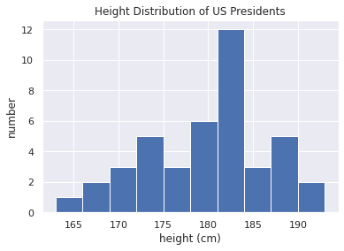

# catalogue
<!-- TOC Marked -->

+ [聚合：最小值、最大值和其他值](#聚合：最小值、最大值和其他值)
    * [1. 数组值求和](#1.-数组值求和)
    * [2. 最小值和最大值](#2.-最小值和最大值)
        - [2.1 多维度聚合](#2.1-多维度聚合)
        - [2.2 其他聚合函数](#2.2-其他聚合函数)
    * [3. 示例：美国总统的身高多少](#3.-示例：美国总统的身高多少)

<!-- /TOC -->
# 聚合：最小值、最大值和其他值

聚合值？  
均值、标准差、求和、乘积、中位数、最小值和最大值、分位数等等

## 1. 数组值求和

计算一个数组中所有元素的和


```python
import numpy as np
l = np.random.random(100)
sum(l)
```


    46.3766633424581


```python
np.sum(l)
```


    46.37666334245809


tip:因为Numpy的sum函数在编译码中执行操作，所以速度更快


```python
big_array = np.random.rand(1000000)
%timeit sum(big_array)
%timeit np.sum(big_array)
```

    76.9 ms ± 1.09 ms per loop (mean ± std. dev. of 7 runs, 10 loops each)
    517 µs ± 34.4 µs per loop (mean ± std. dev. of 7 runs, 1000 loops each)


**sum和np.sum并不相同，他们有不同的参数

## 2. 最小值和最大值


```python
min(big_array), max(big_array)
```


    (2.6184678780794e-07, 0.9999985432723584)


```python
np.min(big_array), np.max(big_array)
```


    (2.6184678780794e-07, 0.9999985432723584)


```python
%timeit min(big_array)
%timeit np.min(big_array)
```

    60.5 ms ± 1.61 ms per loop (mean ± std. dev. of 7 runs, 10 loops each)
    549 µs ± 41.4 µs per loop (mean ± std. dev. of 7 runs, 1000 loops each)


**对于这些min、max、sum等其他聚合，可以直接用数组对象直接调用这些方法**


```python
print(big_array.min(), big_array.max(), big_array.sum())
```

    2.6184678780794e-07 0.9999985432723584 500116.5214055311


### 2.1 多维度聚合


```python
m = np.random.random((3, 4))
print(m)
```

    [[0.44426922 0.24576524 0.67396893 0.23248086]
     [0.95586186 0.78895229 0.1184664  0.15532576]
     [0.56354746 0.48016729 0.02879399 0.85676756]]


```python
m.sum() # 默认返回整个数组的聚合
```


    5.544366864750048


```python
m.sum(axis=0) # axis指定将被折叠的维度，行将被折叠，故表示每一列被聚合
```


    array([1.96367855, 1.51488482, 0.82122932, 1.24457418])


```python
m.sum(axis=1)
```


    array([1.59648425, 2.01860632, 1.92927629])


### 2.2 其他聚合函数

|    函数名称   |    NaN安全版本   | 描述                     |
|:-------------:|:----------------:|:------------------------:|
|     np.sum    |     np.nansum    | 计算元素的和             |
|    np.prod    |    np.nanprod    | 计算元素的积             |
|    np.mean    |    np.nanmean    | 计算元素的平均值         |
|     np.std    |     np.nanstd    | 计算元素的标准差         |
|     np.var    |     np.nanvar    | 计算元素的方差           |
|     np.min    |     np.nanmin    | 找出最小值               |
|     np.max    |     np.nanmax    | 找出最大值               |
|   np.argmin   |   np.nanargmin   | 找出最小值的索引         |
|   np.argmax   |   np.nanargmax   | 找出最大值的索引         |
|   np.median   |   np.nanmedian   | 计算元素的中位数         |
| np.percentile | np.nanpercentile | 计算基于元素排序的统计值 |
|     np.any    |        N/A       | 验证任何一个元素是否为真 |
|     np.all    |        N/A       | 验证所有元素是否为真     |


## 3. 示例：美国总统的身高多少


```python
!head -4 data/president_heights.csv
```

    order,name,height(cm)
    1,George Washington,189
    2,John Adams,170
    3,Thomas Jefferson,189


```python
import pandas as pd
```


```python
data = pd.read_csv('data/president_heights.csv')
heights = np.array(data['height(cm)'])
print(heights)
```

    [189 170 189 163 183 171 185 168 173 183 173 173 175 178 183 193 178 173
     174 183 183 168 170 178 182 180 183 178 182 188 175 179 183 193 182 183
     177 185 188 188 182 185]


```python
data
```


<div>
<style scoped>
    .dataframe tbody tr th:only-of-type {
        vertical-align: middle;
    }

    .dataframe tbody tr th {
        vertical-align: top;
    }

    .dataframe thead th {
        text-align: right;
    }
</style>
<table border="1" class="dataframe">
  <thead>
    <tr style="text-align: right;">
      <th></th>
      <th>order</th>
      <th>name</th>
      <th>height(cm)</th>
    </tr>
  </thead>
  <tbody>
    <tr>
      <th>0</th>
      <td>1</td>
      <td>George Washington</td>
      <td>189</td>
    </tr>
    <tr>
      <th>1</th>
      <td>2</td>
      <td>John Adams</td>
      <td>170</td>
    </tr>
    <tr>
      <th>2</th>
      <td>3</td>
      <td>Thomas Jefferson</td>
      <td>189</td>
    </tr>
    <tr>
      <th>3</th>
      <td>4</td>
      <td>James Madison</td>
      <td>163</td>
    </tr>
    <tr>
      <th>4</th>
      <td>5</td>
      <td>James Monroe</td>
      <td>183</td>
    </tr>
    <tr>
      <th>5</th>
      <td>6</td>
      <td>John Quincy Adams</td>
      <td>171</td>
    </tr>
    <tr>
      <th>6</th>
      <td>7</td>
      <td>Andrew Jackson</td>
      <td>185</td>
    </tr>
    <tr>
      <th>7</th>
      <td>8</td>
      <td>Martin Van Buren</td>
      <td>168</td>
    </tr>
    <tr>
      <th>8</th>
      <td>9</td>
      <td>William Henry Harrison</td>
      <td>173</td>
    </tr>
    <tr>
      <th>9</th>
      <td>10</td>
      <td>John Tyler</td>
      <td>183</td>
    </tr>
    <tr>
      <th>10</th>
      <td>11</td>
      <td>James K. Polk</td>
      <td>173</td>
    </tr>
    <tr>
      <th>11</th>
      <td>12</td>
      <td>Zachary Taylor</td>
      <td>173</td>
    </tr>
    <tr>
      <th>12</th>
      <td>13</td>
      <td>Millard Fillmore</td>
      <td>175</td>
    </tr>
    <tr>
      <th>13</th>
      <td>14</td>
      <td>Franklin Pierce</td>
      <td>178</td>
    </tr>
    <tr>
      <th>14</th>
      <td>15</td>
      <td>James Buchanan</td>
      <td>183</td>
    </tr>
    <tr>
      <th>15</th>
      <td>16</td>
      <td>Abraham Lincoln</td>
      <td>193</td>
    </tr>
    <tr>
      <th>16</th>
      <td>17</td>
      <td>Andrew Johnson</td>
      <td>178</td>
    </tr>
    <tr>
      <th>17</th>
      <td>18</td>
      <td>Ulysses S. Grant</td>
      <td>173</td>
    </tr>
    <tr>
      <th>18</th>
      <td>19</td>
      <td>Rutherford B. Hayes</td>
      <td>174</td>
    </tr>
    <tr>
      <th>19</th>
      <td>20</td>
      <td>James A. Garfield</td>
      <td>183</td>
    </tr>
    <tr>
      <th>20</th>
      <td>21</td>
      <td>Chester A. Arthur</td>
      <td>183</td>
    </tr>
    <tr>
      <th>21</th>
      <td>23</td>
      <td>Benjamin Harrison</td>
      <td>168</td>
    </tr>
    <tr>
      <th>22</th>
      <td>25</td>
      <td>William McKinley</td>
      <td>170</td>
    </tr>
    <tr>
      <th>23</th>
      <td>26</td>
      <td>Theodore Roosevelt</td>
      <td>178</td>
    </tr>
    <tr>
      <th>24</th>
      <td>27</td>
      <td>William Howard Taft</td>
      <td>182</td>
    </tr>
    <tr>
      <th>25</th>
      <td>28</td>
      <td>Woodrow Wilson</td>
      <td>180</td>
    </tr>
    <tr>
      <th>26</th>
      <td>29</td>
      <td>Warren G. Harding</td>
      <td>183</td>
    </tr>
    <tr>
      <th>27</th>
      <td>30</td>
      <td>Calvin Coolidge</td>
      <td>178</td>
    </tr>
    <tr>
      <th>28</th>
      <td>31</td>
      <td>Herbert Hoover</td>
      <td>182</td>
    </tr>
    <tr>
      <th>29</th>
      <td>32</td>
      <td>Franklin D. Roosevelt</td>
      <td>188</td>
    </tr>
    <tr>
      <th>30</th>
      <td>33</td>
      <td>Harry S. Truman</td>
      <td>175</td>
    </tr>
    <tr>
      <th>31</th>
      <td>34</td>
      <td>Dwight D. Eisenhower</td>
      <td>179</td>
    </tr>
    <tr>
      <th>32</th>
      <td>35</td>
      <td>John F. Kennedy</td>
      <td>183</td>
    </tr>
    <tr>
      <th>33</th>
      <td>36</td>
      <td>Lyndon B. Johnson</td>
      <td>193</td>
    </tr>
    <tr>
      <th>34</th>
      <td>37</td>
      <td>Richard Nixon</td>
      <td>182</td>
    </tr>
    <tr>
      <th>35</th>
      <td>38</td>
      <td>Gerald Ford</td>
      <td>183</td>
    </tr>
    <tr>
      <th>36</th>
      <td>39</td>
      <td>Jimmy Carter</td>
      <td>177</td>
    </tr>
    <tr>
      <th>37</th>
      <td>40</td>
      <td>Ronald Reagan</td>
      <td>185</td>
    </tr>
    <tr>
      <th>38</th>
      <td>41</td>
      <td>George H. W. Bush</td>
      <td>188</td>
    </tr>
    <tr>
      <th>39</th>
      <td>42</td>
      <td>Bill Clinton</td>
      <td>188</td>
    </tr>
    <tr>
      <th>40</th>
      <td>43</td>
      <td>George W. Bush</td>
      <td>182</td>
    </tr>
    <tr>
      <th>41</th>
      <td>44</td>
      <td>Barack Obama</td>
      <td>185</td>
    </tr>
  </tbody>
</table>
</div>


```python
print("Mean height: ", heights.mean())
print("Standard height: ", heights.std()) # 标准差
print("Minimum height: ", heights.min())
print("Maximum height: ", heights.max())
```

    Mean height:  179.73809523809524
    Standard height:  6.931843442745892
    Minimum height:  163
    Maximum height:  193


计算分位数


```python
print("25th percentile: ", np.percentile(heights, 25)) # 25%分位数
print("Median: ", np.median(heights)) # 中位数
print("75th percentile: ", np.percentile(heights, 75)) # 75%分位数
```

    25th percentile:  174.25
    Median:  182.0
    75th percentile:  183.0


**可视化数据**


```python
%matplotlib inline
import matplotlib.pyplot as plt
import seaborn
seaborn.set()  # 设置绘图风格
```


```python
plt.hist(heights)
plt.title('Height Distribution of US Presidents')
plt.xlabel('height (cm)')
plt.ylabel('number')
```


    Text(0, 0.5, 'number')


    

    

