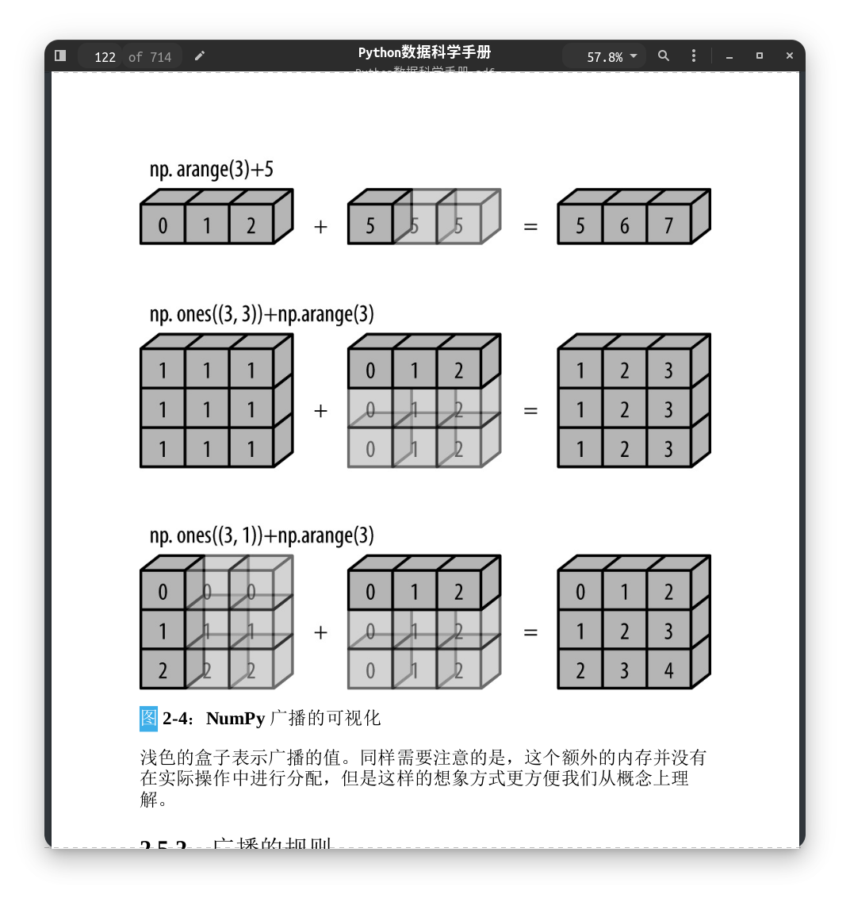
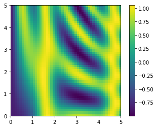

# catalogue

<!-- TOC Marked -->

+ [数组的计算：广播](#数组的计算：广播)
    * [1. 广播的介绍](#1.-广播的介绍)
    * [2. 广播的规则](#2.-广播的规则)
        - [2.1 广播示例 1](#2.1-广播示例-1)
        - [2.2 广播示例 2](#2.2-广播示例-2)
        - [2.3 广播示例 3](#2.3-广播示例-3)
    * [3. 广播的实际应用](#3.-广播的实际应用)
        - [3.1 数组的归一化](#3.1-数组的归一化)
        - [3.2 画一个二维函数](#3.2-画一个二维函数)

<!-- /TOC -->

# 数组的计算：广播

**广播是对于不同大小的数组的二进制通用函数的一组规则**

## 1. 广播的介绍

```python
import numpy as np
a = np.array([0, 1, 2])
b = np.array([5, 5, 5])
a + b
```

    array([5, 6, 7])

a + 5 表示将数值 5 扩展或重复至数组[5, 5, 5]，然后执行加法。  
广播功能实际上并没有执行对值的重复

```python
a + 5
```

    array([5, 6, 7])

```python
m = np.ones((3, 3))
m
```

    array([[1., 1., 1.],
           [1., 1., 1.],
           [1., 1., 1.]])

一维数组 a 称之为被广播，它沿着第二个维度扩展到匹配 m 数组的形状

```python
m + a
```

    array([[1., 2., 3.],
           [1., 2., 3.],
           [1., 2., 3.]])

**对两个数组同时广播**

```python
a = np.arange(3)
b = np.arange(3)[:, np.newaxis]
print(a)
print(b)
```

    [0 1 2]
    [[0]
     [1]
     [2]]

```python
a + b
```

    array([[0, 1, 2],
           [1, 2, 3],
           [2, 3, 4]])



## 2. 广播的规则

> - 规则 1：如果两个数组的维度数不同，那么小维度的数组会在左边补 1
> - 规则 2：如果两个数组的形状在任何一个维度上都不匹配，那么数组的  
>   形状会沿着维度为 1 的维度扩展以匹配另一个数组的形状
> - 规则 3：如果两个数组的形状在任何一个维度上都不匹配且没有任何一个  
>   维度为 1,那么会引发异常

### 2.1 广播示例 1

将一个二维数组和一个一维数组相加

```python
m = np.ones((2, 3))
a = np.arange(3)
print(m.shape)
print(a.shape)
```

    (2, 3)
    (3,)

**根据规则 1,数组 a 的维度更小，在其左边补 1**  
m.shape -> (2, 3)  
a.shape -> (1, 3)  
**根据规则 2,第一个维度不匹配，扩展这个维度以匹配数组**  
m.shape -> (2, 3)  
a.shape -> (2, 3)

```python
m
```

    array([[1., 1., 1.],
           [1., 1., 1.]])

```python
a
```

    array([0, 1, 2])

```python
m + a
```

    array([[1., 2., 3.],
           [1., 2., 3.]])

### 2.2 广播示例 2

```python
a = np.arange(3).reshape(3, 1)
b = np.arange(3)
print(a.shape)
print(b.shape)
```

    (3, 1)
    (3,)

**根据规则 1,用 1 将 b 补全**  
a.shape -> (3, 1)  
b.shape -> (1, 3)  
**根据规则 2,更新数组维度**  
a.shape -> (3, 3)  
b.shape -> (3, 3)

```python
a + b
```

    array([[0, 1, 2],
           [1, 2, 3],
           [2, 3, 4]])

### 2.3 广播示例 3

```python
m = np.ones((3, 2))
a = np.arange(3)
print(m.shape)
print(a.shape)
```

    (3, 2)
    (3,)

**根据规则 1,对第二个数组左边补 1**  
m.shape -> (3, 2)  
a.shape -> (1, 3)  
**根据规则 2,a 数组的第一个维度扩展**  
m.shape -> (3, 2)  
a.shape -> (3, 3)  
**根据规则 3,最终形状不匹配，报错**

```python
m + a
```

    ---------------------------------------------------------------------------

    ValueError                                Traceback (most recent call last)

    <ipython-input-17-68d7e196ee7e> in <module>
    ----> 1 m + a


    ValueError: operands could not be broadcast together with shapes (3,2) (3,)

How to realize right complemention?

```python
a.shape
```

    (3,)

```python
a[:, np.newaxis].shape
```

    (3, 1)

```python
m + a[:, np.newaxis]
```

    array([[1., 1.],
           [2., 2.],
           [3., 3.]])

**广播规则对于任意二进制通用函数都是适用的。  
例如 logaddexp(a, b)函数**  
logaddexp(a, b) = log(exp(a) + exp(b)) = ln(e^a + e^b)

```python
np.logaddexp(m, a[:, np.newaxis])
```

    array([[1.31326169, 1.31326169],
           [1.69314718, 1.69314718],
           [2.31326169, 2.31326169]])

```python
np.log(np.exp(m) + np.exp(a[:, np.newaxis]))
```

    array([[1.31326169, 1.31326169],
           [1.69314718, 1.69314718],
           [2.31326169, 2.31326169]])

## 3. 广播的实际应用

### 3.1 数组的归一化

```python
x = np.random.random((10, 3))
```

```python
xmean = x.mean(axis=0)
xmean
```

    array([0.5498834 , 0.4607805 , 0.46652879])

```python
x_centered = x - xmean # 广播操作，从x数组的元素中减去均值实现归一化
```

```python
x_centered
```

    array([[ 0.30894729,  0.09587686, -0.2536165 ],
           [-0.51368925,  0.52433187,  0.47158472],
           [-0.34156767, -0.42011325, -0.19946168],
           [ 0.24677585, -0.10969171, -0.33134527],
           [ 0.25782221,  0.17723551, -0.26855836],
           [-0.32169796, -0.29602264,  0.10927495],
           [ 0.08100271, -0.10999142, -0.03950077],
           [ 0.12144126, -0.22932362,  0.2433633 ],
           [ 0.38872637,  0.51180859,  0.35231374],
           [-0.2277608 , -0.14411018, -0.08405414]])

```python
x_centered.mean(axis=0)
```

    array([-3.33066907e-17,  9.99200722e-17,  1.11022302e-16])

上式在机器精度内，均值近似为 0

```python
xmeany = x.mean(axis=1)[:, np.newaxis] # mean返回的数组需要进行整形
x_centeredy = x - xmeany
x_centeredy
```

    array([[ 0.31603057,  0.01385724, -0.32988782],
           [-0.61694586,  0.33197236,  0.2849735 ],
           [ 0.03629903, -0.13134945,  0.09505042],
           [ 0.36901539, -0.07655507, -0.29246033],
           [ 0.25980826,  0.09011866, -0.34992691],
           [-0.09473024, -0.15815783,  0.25288807],
           [ 0.16131837, -0.11877866, -0.04253971],
           [ 0.13376678, -0.30610099,  0.17233422],
           [ 0.02859598,  0.06257529, -0.09117126],
           [-0.01829992, -0.02375221,  0.04205213]])

```python
x_centeredy.mean(axis=1)[:, np.newaxis]
```

    array([[ 0.00000000e+00],
           [ 7.40148683e-17],
           [-9.25185854e-18],
           [-5.55111512e-17],
           [-3.70074342e-17],
           [-1.85037171e-17],
           [ 0.00000000e+00],
           [ 3.70074342e-17],
           [ 0.00000000e+00],
           [ 0.00000000e+00]])

### 3.2 画一个二维函数

定义一个二维函数 z=f(x, y)，可以用广播沿着数值区间计算该函数

```python
# np.linspace(start, end, step_number)
x = np.linspace(0, 5, 50)
y = np.linspace(0, 5, 50)[:, np.newaxis]
z = np.sin(x) ** 10 + np.cos(10 + y * x) * np.cos(x)
```

```python
%matplotlib inline
import matplotlib.pyplot as plt
plt.imshow(z, origin='lower', extent=[0, 5, 0, 5],
          cmap='viridis')
plt.colorbar()
```

    <matplotlib.colorbar.Colorbar at 0x7f5ec148bb20>


