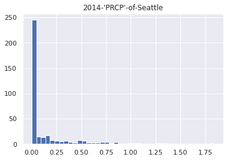

# catalogue

<!-- TOC Marked -->

+ [比较、掩码和布尔逻辑](#比较、掩码和布尔逻辑)
    * [1. 示例：统计下雨天数](#1.-示例：统计下雨天数)
    * [2.和通用函数类似的比较操作](#2.和通用函数类似的比较操作)
    * [3.操作布尔数组](#3.操作布尔数组)
        - [3.1 统计记录的个数](#3.1-统计记录的个数)
        - [3.2 布尔运算符](#3.2-布尔运算符)
    * [4.将布尔数组作为掩码](#4.将布尔数组作为掩码)

<!-- /TOC -->

# 比较、掩码和布尔逻辑

基于某些准则抽取、修改、计数或对一个数组中的值进行其他操作时  
可以利用掩码

## 1. 示例：统计下雨天数

```python
import numpy as np
import pandas as pd

# 利用pandas抽取降雨量，放入一个numpy数组
rainfall = pd.read_csv('data/Seattle2014.csv')['PRCP'].values
inches = rainfall / 254  # 1/10mm -> inches
inches.shape
```

    (365,)

```python
%matplotlib inline
import matplotlib.pyplot as plt
import seaborn; seaborn.set()

plt.hist(inches, 40)
plt.title("2014-'PRCP'-of-Seattle");

```



## 2.和通用函数类似的比较操作

```python
x = np.array([1, 2, 3, 4, 5])
x < 3
```

    array([ True,  True, False, False, False])

```python
x > 3
```

    array([False, False, False,  True,  True])

```python
x <= 3
```

    array([ True,  True,  True, False, False])

```python
x >= 3
```

    array([False, False,  True,  True,  True])

```python
x != 3
```

    array([ True,  True, False,  True,  True])

```python
x == 3
```

    array([False, False,  True, False, False])

**用复合表达式实现对两个数组的逐元素比较**

```python
(2 * x) == (x ** 2)
```

    array([False,  True, False, False, False])

| 运算符 | 对应的通用函数   |
| ------ | ---------------- |
| ==     | np.equal         |
| !=     | np.not\_\_equal  |
| <      | np.less          |
| <=     | np.less_equal    |
| >      | np.greater       |
| >=     | np.greater_equal |

```python
rng = np.random.RandomState(0)
x = rng.randint(10, size=(3, 4))
x
```

    array([[5, 0, 3, 3],
           [7, 9, 3, 5],
           [2, 4, 7, 6]])

```python
x < 6
```

    array([[ True,  True,  True,  True],
           [False, False,  True,  True],
           [ True,  True, False, False]])

## 3.操作布尔数组

```python
print(x)
```

    [[5 0 3 3]
     [7 9 3 5]
     [2 4 7 6]]

### 3.1 统计记录的个数

统计布尔数组中 True 的个数，用 np.count_nonzero()

```python
np.count_nonzero(x < 6)
```

    8

等效于 np.sum(),True 会被解释成 1,False 会被解释成 0

```python
np.sum(x < 6)
```

    8

sum 可以沿着行或列进行

```python
np.sum(x < 6, axis=1) #shape: (3, 4) -> (3, 1)
```

    array([4, 2, 2])

**要检查任意或者所有这些值是否为 True，可以用 np.any()或 np.all()**

```python
# 有没有值大于8？
np.any(x > 8)
```

    True

```python
# 是否所有值小于10？
np.all(x < 10)
```

    True

```python
np.all(x < 8, axis=1)
```

    array([ True, False,  True])

### 3.2 布尔运算符

逐位逻辑运算符&, |, ^, ~来实现

```python
np.sum((inches > 0.5) & (inches < 1))
```

    29

```python
# 等价于
np.sum(~((inches <= 0.5) | (inches >= 1)))
```

    29

| 运算符 | 对应通用函数   |
| ------ | -------------- |
| &      | np.bitwise_and |
| \|     | np.bitwise_or  |
| ^      | np.bitwise_xor |
| ~      | np.bitwise_not |

**利用掩码和聚合实现对天气数据分析**

```python
print("Number days without rain: ", np.sum(inches == 0))
print("Number days with rain: ", np.sum(inches != 0))
print("Days with more than 0.5 inches: ", np.sum(inches > 0.5))
print("Rainy days with < 0.1 inches: ", np.sum((inches > 0) & (inches < 0.2)))
```

    Number days without rain:  215
    Number days with rain:  150
    Days with more than 0.5 inches:  37
    Rainy days with < 0.1 inches:  75

## 4.将布尔数组作为掩码

掩码：对数组中的值进行按位&，|，^，～

```python
x
```

    array([[5, 0, 3, 3],
           [7, 9, 3, 5],
           [2, 4, 7, 6]])

```python
x < 5
```

    array([[False,  True,  True,  True],
           [False, False,  True, False],
           [ True,  True, False, False]])

**用掩码操作对 x 进行索引**

```python
x[x < 5]
```

    array([0, 3, 3, 3, 2, 4])

```python
# 为所有下雨天创造一个掩码
rainy = (inches > 0)

# 构建一个包含整个夏季日期的掩码,6月21日是172天
summer = (np.arange(365) - 172 < 90) & (np.arange(365) - 172 > 0)
print("Median precip on rainy days in 2014 (inches): ",
     np.median(inches[rainy]))
print("Median precip on summer days in 2014 (inches): ",
     np.median(inches[summer]))
print("Maximum precip on summer days in 1024 (inches): ",
     np.max(inches[summer]))
print("Median precip on non-summer rainy days (inches): ",
     np.median(inches[rainy & ~summer]))
```

    Median precip on rainy days in 2014 (inches):  0.19488188976377951
    Median precip on summer days in 2014 (inches):  0.0
    Maximum precip on summer days in 1024 (inches):  0.8503937007874016
    Median precip on non-summer rainy days (inches):  0.20078740157480315

**and 和 or 判断整个对象的真假，而&和|指每个对象中的比特位**

```python
bool(42), bool(0)
```

    (True, False)

```python
bool(42 and 0)
```

    False

```python
bool(42 or 0)
```

    True

```python
bin(42) # 101010B
```

    '0b101010'

```python
bin(59) # 111011B
```

    '0b111011'

```python
bin(42 & 59) # 按位与运算
```

    '0b101010'

```python
bin(42 | 59) # 按位或运算
```

    '0b111011'

**将 Numpy 中的布尔数组当作由比特字符组成的**

```python
a = np.array([1, 0, 1, 0, 1, 0], dtype=bool)
b = np.array([1, 1, 1, 0, 1, 1], dtype=bool)
a | b
```

    array([ True,  True,  True, False,  True,  True])

```python
a or b # 计算整个数组的真假，导致程序出错
```

    ---------------------------------------------------------------------------

    ValueError                                Traceback (most recent call last)

    <ipython-input-61-aeea32690a12> in <module>
    ----> 1 a or b # 计算整个数组的真假，导致程序出错


    ValueError: The truth value of an array with more than one element is ambiguous. Use a.any() or a.all()

对给定数组进行逻辑运算时，应该用|或者&，而不是 and，ork

```python
x = np.arange(10)
(x > 4) & (x < 8)
```

    array([False, False, False, False, False,  True,  True,  True, False,
           False])

```python
(x > 4) and (x < 8) #计算整个数组的真假会报错
```

    ---------------------------------------------------------------------------

    ValueError                                Traceback (most recent call last)

    <ipython-input-63-48ba84cb91fd> in <module>
    ----> 1 (x > 4) and (x < 8) #计算整个数组的真假会报错


    ValueError: The truth value of an array with more than one element is ambiguous. Use a.any() or a.all()

总结：and 和 or 对整个对象执行单个布尔运算，而&和|对一个对象的内容  
（单个比特或字节）执行多个布尔运算，对于 Numpy 数组，常用位运算
