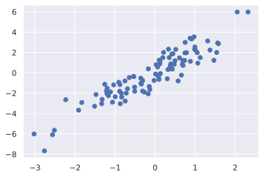
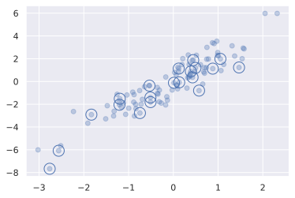
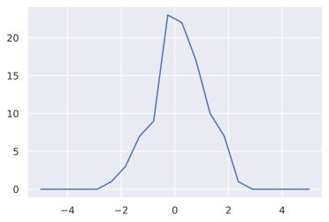
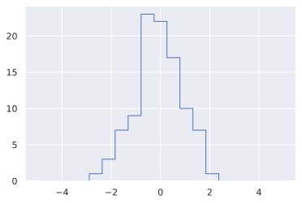

# catelogue

<!-- TOC Marked -->

+ [花哨的索引](#花哨的索引)
    * [1. 探索花哨的索引](#1.-探索花哨的索引)
    * [2.组合索引](#2.组合索引)
    * [3.示例：选择随机点](#3.示例：选择随机点)
    * [4.以花哨的索引修改值](#4.以花哨的索引修改值)
    * [5.示例：数据区间划分](#5.示例：数据区间划分)

<!-- /TOC -->

# 花哨的索引

利用简答的索引值可以修改数组，如 arr[0], arr[:5], arr[arr > 0]

## 1. 探索花哨的索引

```python
import numpy as np
rand = np.random.RandomState(42)

x = rand.randint(100, size=10)
print(x)
```

    [51 92 14 71 60 20 82 86 74 74]

方法 1

```python
[x[3], x[7], x[2]]
```

    [71, 86, 14]

方法 2

```python
ind = [3, 7, 4]
x[ind]
```

    array([71, 86, 60])

**结果的形状与索引的一致**

```python
ind = np.array([[3, 7],
                [4, 5]])
x[ind]
```

    array([[71, 86],
           [60, 20]])

**多维度的索引**

```python
x = np.arange(12).reshape((3, 4))
x
```

    array([[ 0,  1,  2,  3],
           [ 4,  5,  6,  7],
           [ 8,  9, 10, 11]])

```python
row = np.array([0, 1, 2])
col = np.array([2, 1, 3])
x[row, col] # 即得到x[0, 2], x[1, 1], x[2, 3]
```

    array([ 2,  5, 11])

索引遵守广播的规则,将一个行向量和列向量组合在一起  
得到一个广播后二维的结果  
index_array = [[0],   &ensp;&ensp;&ensp;&ensp;&ensp;&ensp;&ensp;&ensp;&ensp;              [[[0, 2], [0, 1], [0, 3]],  
&ensp;&ensp;&ensp;&ensp;&ensp;&ensp;&ensp;&ensp;&ensp;&ensp;&ensp;&ensp;&ensp; [1], [2, 1, 3] -> [[1, 2], [1, 1], [1, 3]],  
&ensp;&ensp;&ensp;&ensp;&ensp;&ensp;&ensp;&ensp;&ensp;&ensp;&ensp;&ensp;&ensp; [2]] &ensp;&ensp;&ensp;&ensp;&ensp;&ensp;&ensp;&ensp;&ensp;&ensp; [[2, 2], [2, 1], [2, 3]]]

```python
x[row[:, np.newaxis], col]
```

    array([[ 2,  1,  3],
           [ 6,  5,  7],
           [10,  9, 11]])

## 2.组合索引

```python
print(x)
```

    [[ 0  1  2  3]
     [ 4  5  6  7]
     [ 8  9 10 11]]

```python
x[2, [2, 0, 1]]
```

    array([10,  8,  9])

```python
x[1:, [2, 0, 1]]
# 行取1，2  列取2，0，1
```

    array([[ 6,  4,  5],
           [10,  8,  9]])

```python
print(x)
```

    [[ 0  1  2  3]
     [ 4  5  6  7]
     [ 8  9 10 11]]

```python
mask = np.array([1, 0, 1, 0], dtype=bool)
x[row[:, np.newaxis], mask]
# 行取0，1，2  列取0，2
```

    array([[ 0,  2],
           [ 4,  6],
           [ 8, 10]])

## 3.示例：选择随机点

从一个矩阵中选取行的子集

```python
mean = [0, 0]
cov = [[1, 2],
       [2, 5]]
x = rand.multivariate_normal(mean, cov, 100) # 二维正态分布
x.shape
```

    (100, 2)

```python
%matplotlib inline
import matplotlib.pyplot as plt
import seaborn; seaborn.set()
```

```python
plt.scatter(x[:, 0], x[:, 1]);
```



```python
indices = np.random.choice(x.shape[0], 20, replace=False)
```

```python
indices
```

    array([37, 92,  2, 19, 94, 90, 24, 87, 48, 27, 60, 32, 30, 76, 81,  6, 13,
           64, 67, 33])

```python
selection = x[indices] #fancy index
selection.shape
```

    (20, 2)

```python
plt.scatter(x[:, 0], x[:, 1], alpha=0.3)
plt.scatter(selection[:, 0], selection[:, 1],
           facecolor='none', edgecolor='b', s=200)
```

    <matplotlib.collections.PathCollection at 0x7f739f3eabb0>



## 4.以花哨的索引修改值

```python
x = np.arange(10)
i = np.array([2, 1, 8, 4])
x[i] = 99
print(x)
```

    [ 0 99 99  3 99  5  6  7 99  9]

```python
x[i] -= 10
print(x)
```

    [ 0 89 89  3 89  5  6  7 89  9]

操作中重复的索引会导致意外

```python
x = np.zeros(10)
x[[0, 0]] = [4, 6]
print(x)
```

    [6. 0. 0. 0. 0. 0. 0. 0. 0. 0.]

```python
i = [2, 3, 3, 4, 4, 4]
x[i] += 1
x
```

    array([6., 0., 1., 1., 1., 0., 0., 0., 0., 0.])

**真正的累加方法**

```python
x = np.zeros(10)
np.add.at(x, i, 1)
print(x)
```

    [0. 0. 1. 2. 3. 0. 0. 0. 0. 0.]

## 5.示例：数据区间划分

可以有效的对数据区间进行划分并手动创建直方图
快速统计区间中的数据频次，用 ufunc.at

```python
np.random.seed(42)
x = np.random.randn(100)

# 手动计算直方图
bins = np.linspace(-5, 5, 20)
counts = np.zeros_like(bins)

# 为每个x找到合适的区间
i = np.searchsorted(bins, x)

# 为每个区间加上1
np.add.at(counts, i, 1)
```

```python
plt.plot(bins, counts, linestyle='-');
```



```python
plt.hist(x, bins, histtype='step');kkkkjjjj
```



```python
 # compare
 print("Numpy routine")
 %timeit counts, edges = np.histogram(x, bins)

 print("Custom routine")
 %timeit np.add.at(counts, np.searchsorted(bins, x), 1)
```

    Numpy routine
    30.7 µs ± 233 ns per loop (mean ± std. dev. of 7 runs, 10000 loops each)
    Custom routine
    13.8 µs ± 31.4 ns per loop (mean ± std. dev. of 7 runs, 100000 loops each)

```python
  x = np.random.randn(1000000)
  print("Numpy routine:")
  %timeit counts, edges = np.histogram(x, bins)

  print("Custom routine:")
  %timeit np.add.at(counts, np.searchsorted(bins, x), 1)
```

    Numpy routine:
    75 ms ± 377 µs per loop (mean ± std. dev. of 7 runs, 10 loops each)
    Custom routine:
    101 ms ± 1.03 ms per loop (mean ± std. dev. of 7 runs, 10 loops each)

```python

```
