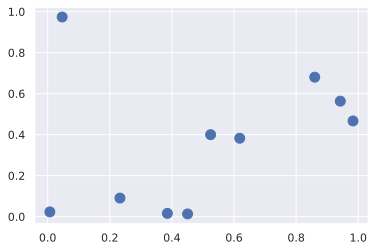
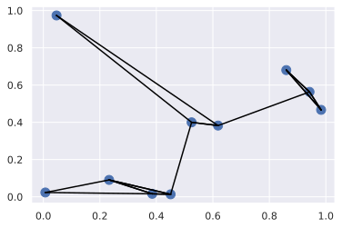

# catalogue

<!-- TOC Marked -->

+ [数组的排序](#数组的排序)
    * [1. Numpy 中的快速排序：np.sort 和 np.argsort](#1.-numpy-中的快速排序：np.sort-和-np.argsort)
    * [2.部分排序：分隔](#2.部分排序：分隔)
    * [3.示例：K 个最近邻](#3.示例：k-个最近邻)

<!-- /TOC -->

# 数组的排序

```python
import numpy as np

def selection_sort(x):
    """选择排序"""
    for i in range(len(x)):
        swap = i + np.argmin(x[i:])
        (x[i], x[swap]) = (x[swap], x[i])
    return x

x = np.array([2, 1, 4, 3, 5])
selection_sort(x)

```

    array([1, 2, 3, 4, 5])

```python
def bogosort(x):
    """bogo排序，随机重排"""
    while np.any(x[:-1] > x[1:]):
        np.random.shuffle(x)
    return x

x = np.array([2, 1, 3, 5, 4])
bogosort(x)
```

    array([1, 2, 3, 4, 5])

## 1. Numpy 中的快速排序：np.sort 和 np.argsort

在不修改原始输入数组的情况下返回一个排序好的数组，使用 np.sort()函数

```python
x = np.array([2, 1, 4, 3, 5])
%timeit np.sort(x)
np.sort(x)
```

    2.21 µs ± 46.3 ns per loop (mean ± std. dev. of 7 runs, 100000 loops each)


    array([1, 2, 3, 4, 5])

希望排序好的数组代替原始数组，可以使用数组的 sort 方法

```python
x.sort()
print(x)
```

    [1 2 3 4 5]

np.argsort()函数返回的是原始数组排序好的索引值

```python
x = np.array([2, 1, 4, 3, 5])
i = np.argsort(x)
print(i)
# 可以通过索引值用fancy index创建有序的数组
print(x[i])
```

    [1 0 3 2 4]
    [1 2 3 4 5]

**通过 axis 参数沿着行或者列进行多维数组的排序**

```python
rand = np.random.RandomState(42)
x = rand.randint(0, 10, (4, 6))
print(x)
```

    [[6 3 7 4 6 9]
     [2 6 7 4 3 7]
     [7 2 5 4 1 7]
     [5 1 4 0 9 5]]

```python
np.sort(x, axis=0)
```

    array([[2, 1, 4, 0, 1, 5],
           [5, 2, 5, 4, 3, 7],
           [6, 3, 7, 4, 6, 7],
           [7, 6, 7, 4, 9, 9]])

```python
np.sort(x, axis=1)
```

    array([[3, 4, 6, 6, 7, 9],
           [2, 3, 4, 6, 7, 7],
           [1, 2, 4, 5, 7, 7],
           [0, 1, 4, 5, 5, 9]])

## 2.部分排序：分隔

np.partition()函数的输入是数组和数字 K，输出结果是一个新数组  
左边 K 个数是任意排序最小的 K 个值，往右是任意顺序的其他值：

```python
x = np.array([7, 2, 3, 1, 6, 5, 4])
np.partition(x, 3) # 取三个最小的值放在左边
```

    array([2, 1, 3, 4, 6, 5, 7])

```python
x = np.random.randint(0, 10, size=20).reshape(4, 5)
print(x)
print(np.partition(x, 2, axis=0))
print(np.partition(x, 2, axis=1))
```

    [[3 8 0 8 0]
     [8 7 5 0 5]
     [4 8 7 2 3]
     [0 2 9 4 5]]
    [[0 2 0 0 0]
     [3 7 5 2 3]
     [4 8 7 4 5]
     [8 8 9 8 5]]
    [[0 0 3 8 8]
     [0 5 5 8 7]
     [2 3 4 7 8]
     [0 2 4 9 5]]

类似的函数还有 np.argpartition()

## 3.示例：K 个最近邻

```python
x = rand.rand(10 ,2) # 坐标（x， y）
x
```

    array([[0.00706631, 0.02306243],
           [0.52477466, 0.39986097],
           [0.04666566, 0.97375552],
           [0.23277134, 0.09060643],
           [0.61838601, 0.38246199],
           [0.98323089, 0.46676289],
           [0.85994041, 0.68030754],
           [0.45049925, 0.01326496],
           [0.94220176, 0.56328822],
           [0.3854165 , 0.01596625]])

```python
%matplotlib inline
import matplotlib.pyplot as plt
import seaborn; seaborn.set() # 设置画图风格
plt.scatter(x[:, 0], x[:, 1], s=100);
```



**计算两两数据点之间的距离**

```python
dist_sq = np.sum(x[:, np.newaxis, :] - x[np.newaxis, :, :] ** 2, axis=-1)
```

```python
 # 在坐标系中计算每对点的差值,[10, 1, 2] - [1, 10 ,2]
 differences = x[:, np.newaxis, :] - x[np.newaxis, :, :]
 differences.shape
```

    (10, 10, 2)

```python
# 求出差值的平方
sq_differences = differences ** 2
sq_differences.shape
```

    (10, 10, 2)

```python
# 将差值求和获得平方距离
dist_sq = sq_differences.sum(-1)
dist_sq.shape
```

    (10, 10)

得到了一个转化为两点间的平方距离的矩阵

```python
nearest = np.argsort(dist_sq, axis=1)
print(nearest)
```

    [[0 3 9 7 1 4 2 5 6 8]
     [1 4 7 9 3 6 8 5 0 2]
     [2 1 4 6 3 0 8 9 7 5]
     [3 9 7 0 1 4 5 8 6 2]
     [4 1 8 5 6 7 9 3 0 2]
     [5 8 6 4 1 7 9 3 2 0]
     [6 8 5 4 1 7 9 3 2 0]
     [7 9 3 1 4 0 5 8 6 2]
     [8 5 6 4 1 7 9 3 2 0]
     [9 7 3 0 1 4 5 8 6 2]]

```python
K = 2
nearest_partition = np.argpartition(dist_sq, K + 1, axis=1)
```

```python
plt.scatter(x[:, 0], x[:, 1], s=100)

# 将每个点和它的最近邻连接
K = 2

for i in range(x.shape[0]):
    for j in nearest_partition[i, :K+1]:
        # 画一条从x[i]到x[j]的线段
        # 用zip方法实现
        plt.plot(*zip(x[j], x[i]), color='black')
```



```python

```
